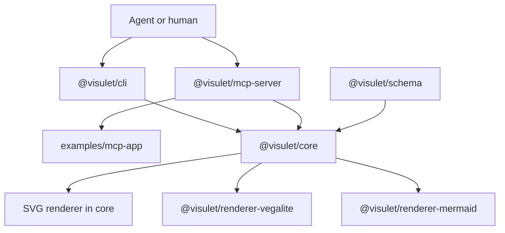
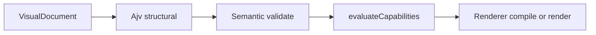
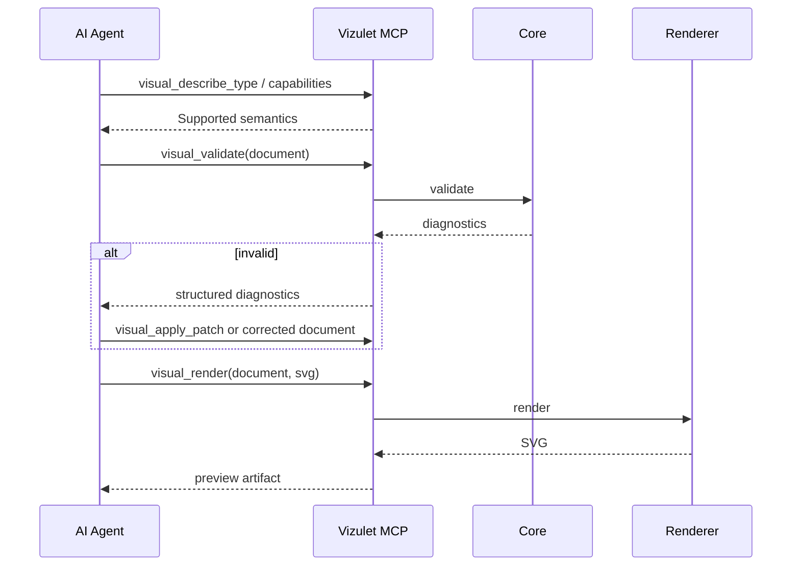

# RFC 0002: Vizulet Post-v0 Roadmap — Benchmark-Driven IR Stabilization, Mermaid, Vega-Lite, MCP, and MCP App

- **Status:** Draft
- **Authors:** Vizulet maintainers
- **Target repository:** `yu-iskw/visulet`
- **Created:** 2026-08-15
- **Revised:** 2026-08-15
- **Supersedes:** RFC 0001 §§18–20 (CLI / MCP / MCP App surface) for post-v0 work
- **Does not supersede:** VisualDocument v0 document model (RFC 0001) until RFC 0003
- **Builds on:** RFC 0001 / `VisualDocument v0` and `0001-adversarial-review.md`
- **Companion:** `0002-adversarial-review.md`
- **Intended audience:** Maintainers, contributors, coding agents, integrators, renderer authors, MCP client authors

---

## 1. Summary

This RFC is the implementation contract for taking Vizulet from the current v0
proof of concept to a measured, agent-friendly, multi-backend visual compiler.

It does **not** treat the current IR as stable. The design hypothesis is still:

> Can AI agents author and incrementally modify Vizulet's renderer-neutral
> semantic IR more reliably, efficiently, and portably than they can author
> renderer-specific specifications directly?

**Stabilize semantics before freezing integrations.** Integrations that exist
only as a measurement surface (CLI, thin MCP) may ship earlier so the live
benchmark tests the intended agent interface.

The sequence is kill-gated:

1. Contract hygiene in `@visulet/core` (diagnostics, capabilities, typed
   sequence, Ajv on render/score, field inference, inspect, limits).
2. RFC 6902 patch API and CLI (`validate`, `inspect`, `render`, `patch`).
3. Benchmark v1 offline harness, ~40 in-scope cases, control fixtures in CI.
4. Thin stdio MCP server isomorphic to those CLI operations.
5. Live stratified benchmark and a written go / no-go. **STOP** before v1 or
   MCP App polish if gates fail; open RFC 0003 for IR breaks.
6. `VisualRenderer` interface plus `@visulet/renderer-mermaid` and
   `@visulet/renderer-vegalite` (SVG stays in core).
7. Full MCP resources, `visual_describe_type`, compile tools, experimental
   `examples/mcp-app`.
8. v1 freeze and npm publish **only if** Phase 5 said go.

---

## 2. Motivation

Vizulet should become an AI-native visual compiler, not another renderer DSL.

A coding or reasoning agent should be able to:

- describe analytical intent semantically;
- create a `VisualDocument`;
- validate it deterministically;
- receive compact, actionable diagnostics;
- patch a small portion of the document rather than regenerate it;
- compile it into multiple renderer targets;
- preview it safely;
- use the same document through library, CLI, MCP, and later hosts.

Long-term properties, in priority order:

1. **Agent authorability** — low invalid-output rate, clear repair, local
   edits, stable codes.
2. **Renderer portability** — canonical semantics; explicit capability gaps;
   no silent degradation.
3. **Determinism** — validation, compilation, and rendering do not require an
   LLM.
4. **Security** — no arbitrary JS, no implicit network, no filesystem
   traversal; native escape hatches explicit and auditable.
5. **Extensibility** — new renderers without changing every client.
6. **Progressive stabilization** — compatibility promises follow evidence.

---

## 3. Goals

### 3.1 Primary goals

- Honest inventory of v0 and a written defect list closed before live runs.
- Benchmark v1: generation and modification cases, experiment manifests,
  provider-neutral runner, optional provider adapters, offline candidate
  ingestion, raw metrics, named scoring profiles, control-mode CI.
- Domain-stratified comparison: charts vs Vega-Lite, diagrams vs Mermaid,
  infographics Vizulet-only.
- IR revision workflow (RFC 0003) when live evidence demands it.
- Mermaid source compiler and Vega-Lite JSON compiler for the supported
  subset, with machine-readable capabilities.
- CLI for validate / inspect / render / patch / compile.
- MCP stdio server with a small generic tool set plus type discovery.
- Experimental MCP App in `examples/`, not a v1 gate.
- Security limits, structured diagnostics, golden and conformance tests.

### 3.2 Secondary goals

- Practical use from Cursor, Claude Code, and other MCP hosts.
- Machine-readable benchmark results.
- Inspectable renderer differences.
- Predictable failure behavior for agent self-repair.

---

## 4. Non-goals

- Building a reactive BI dashboard runtime.
- Running arbitrary user JavaScript in documents.
- Fetching remote datasets in `@visulet/core`.
- A full spreadsheet engine.
- Implementing every Vega-Lite or Mermaid feature.
- Heuristic translation that hides incompatibility.
- An LLM inside the validator or compiler.
- Model-provider orchestration inside canonical core packages.
- `visulet convert` (Mermaid → Vizulet) in this RFC.
- Extracting `@visulet/renderer-svg` in this RFC.
- Live-model calls in default CI.
- Promising v1 dates or compatibility before Phase 5 gates pass.
- Hosted multi-tenant SaaS.
- Authentication policy beyond interfaces hosts can enforce.
- Publishing the MCP App as an npm package.

---

## 5. Current State (inventory as of 2026-08-15)

The v0 vertical slice is real and small:

| Surface | Status |
| --- | --- |
| `@visulet/schema` (`schemas/`) | Normative JSON Schema Draft 2020-12, version `"0"` |
| `@visulet/core` (`packages/common`) | Structural Ajv validation, semantic validation, SVG render, 100-point scorer |
| SVG renderer | In core. Charts: `bar`, `line`, `scatter`, `heatmap`. Diagrams: `flowchart`, `sequence`, `architecture`. Infographics: `list`, `steps`, `process` |
| CLI | Does not exist |
| Vega-Lite backend | Does not exist |
| Mermaid backend | Does not exist |
| Capability API | Schema `$defs/rendererCapability` and view `renderer` preference exist; **no runtime resolution**. Semantic validator emits SVG-specific catalog warnings |
| JSON Patch | Specified in RFC 0001 §17; not implemented |
| MCP / MCP App | Keywords and RFC 0001 §§19–20 only |
| Benchmark corpus | 10 generation-only JSONL cases in `benchmarks/agent-authoring/v0/` |
| Benchmark runner | None. `scoreAuthoringCandidate` only |
| Packages | Both `"private": true`. `publish.yml` cannot publish them as-is |

Running catalog (authoritative for this RFC, not RFC 0001 §32’s `comparison`
bullet): `list`, `steps`, `process`.

### 5.1 Known v0 defects (must fix before live benchmark)

1. **Ajv bypass.** `renderSvgDocument` and `scoreAuthoringCandidate` import
   semantic-only `validate.ts`. Extra keys can render and score.
2. **Capability leakage.** `catalog.*.unsupported` warnings say “v0 SVG
   renderer” inside `validateVisualDocument`.
3. **Untyped sequence `model`.** SVG reads `participants` / `messages` with
   no schema or semantic checks.
4. **Diagnostic shape.** `{ code, severity: error\|warning, path, message }`
   only. Paths are JS (`$.views[0]`), not JSON Pointer. Ajv errors collapse to
   `schema.invalid`. Codes conflict with RFC 0001 (`UNKNOWN_DATASET`) and the
   download draft (`semantic.dataset_not_found`).
5. **Type / schema drift.** Schema has `$schema`, `theme`, `parameters`,
   view `renderer`, `native.data`; TypeScript `VisualDocument` does not.
6. **Field checks require `schema.fields`.** Agents omit schemas. Infer names
   from inline `values` keys.
7. **No resource limits** in validation or render.
8. **No inspect API.**
9. **Example CI gap.** `examples/v0/quarterly-revenue.json` is not asserted
   in tests.
10. **Scorer structural codes** do not include Ajv `schema.invalid`.

These are hygiene, not empirical IR research.

---

## 6. Architectural thesis

One canonical semantic document layer, not one lowest-common-denominator
rendering model.



Dependency direction (packages):

```text
@visulet/schema
        ^
        |
@visulet/core
   ^    ^    ^
   |    |    |
  SVG  VL   Mermaid     (SVG implementation lives in core until extracted)
        ^
        |
  cli / mcp-server
        ^
        |
  examples/mcp-app
```

Core MUST NOT depend on CLI parsers, MCP, React, browser APIs, or renderer
packages. Renderers MUST NOT depend on MCP. CLI and MCP are adapters.

Capability split:



`validateVisualDocument` returns structural and semantic diagnostics only.
`compile` / `render` add `capability.*` and `renderer.*` diagnostics.

---

## 7. Design principles

1. **Benchmark before compatibility.** Do not freeze IR because code exists.
2. **Canonical semantics, explicit gaps.** Faithful compile, documented
   degradation, or reject. Never silent reinterpretation.
3. **Diagnostics are API.** Stable code, severity, JSON Pointer path, message,
   optional hint / backend / metadata.
4. **Patch, do not require rewrite.** RFC 6902 is the mutation protocol.
   Harnesses still score whole-document rewrites via computed patch distance.
5. **Small MCP surface.** Generic document operations plus type discovery.
6. **Security is host-controlled.** Core never grants itself network,
   arbitrary filesystem, process execution, secrets, or JS.
7. **Every backend declares versioned capabilities.**
8. **Kill gates are written decisions**, not vibes.

---

# Part I — Contract hygiene (pre-benchmark)

## 8. Diagnostic contract

```ts
export type DiagnosticSeverity = 'error' | 'warning' | 'info';

export interface Diagnostic {
  readonly code: string;
  readonly severity: DiagnosticSeverity;
  readonly path: string; // JSON Pointer, e.g. /views/0/data
  readonly message: string;
  readonly hint?: string;
  readonly backend?: string;
  readonly metadata?: Readonly<Record<string, unknown>>;
}
```

Namespaces:

```text
schema.*
semantic.*
capability.*
renderer.svg.*
renderer.vega_lite.*
renderer.mermaid.*
patch.*
resource.*
security.*
```

Mapping from v0 codes (breaking for any unpublished client; do it now):

| v0 code | post-hygiene |
| --- | --- |
| `schema.invalid` | `schema.invalid` plus `metadata.keyword` |
| `data.missing` | `semantic.dataset_not_found` |
| `field.missing` | `semantic.field_not_found` |
| `diagram.edge.from` / `.to` | `semantic.diagram_edge_from` / `_to` |
| `view.id.duplicate` | `semantic.duplicate_view_id` |
| `metric.source.required` | `semantic.metric_source_required` |
| `catalog.*.unsupported` | removed from validate; `capability.unsupported_*` at render/compile |
| `native.portability` | `capability.native_escape` (warning; still not an SVG-specific sentence) |
| `render.transforms.unimplemented` | `renderer.svg.transforms_unimplemented` |
| `render.interactions.unimplemented` | `renderer.svg.interactions_unimplemented` |

## 9. Types aligned to schema

TypeScript `VisualDocument` MUST include schema fields used by examples:

- `$schema?: string`
- `theme?`, `parameters?`, `security?`
- per-view `renderer?: RendererPreference`
- `NativeView.data?: string`

## 10. Sequence model

Keep flowchart / architecture on `nodes` / `edges`.

For `diagram: "sequence"`, `model` is constrained:

```json
{
  "participants": [{ "id": "host", "label": "MCP Host" }],
  "messages": [{ "from": "host", "to": "core", "label": "validate" }]
}
```

Semantic validation: unique participant ids; message `from` / `to` must
reference participants. Duplicate node ids on node/edge diagrams remain errors.

The open `model` object remains allowed for other diagram types until RFC 0003.

## 11. Capabilities

```ts
export interface RendererCapabilities {
  readonly id: string;
  readonly version: string;
  readonly visualDocumentVersions: readonly string[];
  readonly visuals: {
    readonly chart?: { readonly types: readonly string[] };
    readonly diagram?: { readonly types: readonly string[] };
    readonly infographic?: { readonly types: readonly string[] };
  };
  readonly data: { readonly inline: boolean; readonly references: readonly string[] };
  readonly interactions: readonly string[];
  readonly outputFormats: readonly string[];
}

export type CapabilityStatus = 'supported' | 'degraded' | 'unsupported';

export function evaluateCapabilities(
  document: VisualDocument,
  capabilities: RendererCapabilities,
): readonly Diagnostic[];
```

SVG advertises the running catalog. Unsupported-but-schema-valid types are
warnings on that backend, not document-invalid.

## 12. Inspect, limits, field inference

```ts
export interface VisualDocumentInspection {
  readonly version: string;
  readonly viewIds: readonly string[];
  readonly kinds: readonly string[];
  readonly datasets: readonly string[];
  readonly nativeViewIds: readonly string[];
  readonly hasInteractions: boolean;
  readonly hasTransforms: boolean;
}

export interface ResourceLimits {
  readonly maxDocumentBytes: number;
  readonly maxViews: number;
  readonly maxInlineRows: number;
  readonly maxStringLength: number;
  readonly maxPatchOperations: number;
}

export const DEFAULT_RESOURCE_LIMITS: ResourceLimits;
```

When `schema.fields` is absent, field existence is checked against the union of
inline `values` keys. Referenced datasets without a schema cannot check fields;
emit `capability.unresolved_reference` at render if the backend needs rows.

`validateVisualDocument`, `renderSvgDocument`, and `scoreAuthoringCandidate`
MUST use the combined structural+semantic pipeline.

---

# Part II — Patch and CLI

## 13. Patch API

RFC 6902 operations: `add`, `remove`, `replace`, `test`, `copy`, `move`.

```ts
export function validateVisualDocumentPatch(patch: unknown): ValidationResult;

export function applyVisualDocumentPatch(
  document: unknown,
  patch: unknown,
  options?: { readonly limits?: ResourceLimits },
): PatchResult;
```

Transactional: copy → apply → limits → structural → semantic. Never throw on
invalid documents. Return diagnostics with `patch.*` codes.

## 14. CLI

Package `@visulet/cli`, binary `visulet`:

```text
visulet validate <file|->
visulet inspect <file|->
visulet render <file|-> --format svg
visulet patch <file|-> --patch <patch-file|->
visulet compile <file|-> --backend svg|vega-lite|mermaid
visulet capabilities [backend]
```

`--json` for machine output. Exit non-zero on error-severity diagnostics.
`compile --backend svg` aliases render until a separate SVG package exists.
No visualization semantics in the CLI. `convert` is out of scope.

---

# Part III — Benchmark v1

## 15. Questions

The live run must answer RFC 0001’s authorability questions, including edit
locality, native-escape rate, diagnostic repair lift, and whether Vizulet
beats domain baselines on validity and repair — not a single scalar.

## 16. Case model

Versioned JSON under `benchmarks/agent-authoring/v1/cases/`.

Generation and modification. Modification cases include `startingArtifact`.
`baselineTargets` is domain-specific (`vega-lite` for charts, `mermaid` for
diagrams, omitted for infographics). `holdout: true` marks cases that must not
be used to tune prompts or schema in the same iteration.

Target size for v1: about 40 in-scope cases (the 10 v0 types × generation +
modification, plus composed, invalid, and repair cases). Path to 100 remains
documented and is not a blocker for later phases.

## 17. Experiment manifest and runner

A run is reproducible from a YAML/JSON manifest: experiment id, repetitions,
sampling, targets, models, prompt profiles (`minimal`, `schema-assisted`,
`diagnostic-repair`, `mcp-tool-repair`), corpus path.

```ts
export interface ModelProvider {
  readonly id: string;
  run(request: ModelRunRequest): Promise<ModelRunResult>;
}
```

Provider adapters (OpenAI, Anthropic, Gemini, OpenRouter) are optional files
outside `@visulet/core`. CI uses **offline candidate ingestion** only.

## 18. Metrics and scoring profiles

Store raw metrics always: structural/semantic validity, per-backend compile,
tokens, latency, correction turns, patch-op count, changed paths, rewrite
ratio, native-escape, capability warning counts.

Named scoring profile `chart-generation-v1` (and siblings) MAY compute
composites from documented weights. CI never compares live-model composites.
CI asserts control-fixture scores and result schema validity.

## 19. Gates (hypotheses)

On in-scope, non-holdout generation tasks, after one repair cycle:

- structural validity ≥ 95%;
- semantic validity ≥ 90%;
- native escape &lt; 25%;
- no material regression vs Vega-Lite on chart tasks or Mermaid on diagram
  tasks (overlapping confidence intervals count as no regression).

**STOP:** if native-escape ≥ 25% or Vizulet loses on first-pass+repair
validity versus the domain baseline, do not freeze v1 or polish the MCP App.
Write RFC 0003. Mermaid and Vega-Lite may still proceed if needed to *measure*
portability.

---

# Part IV — MCP

## 20. Thin server (measurement surface)

`@visulet/mcp-server`, stdio first. Tools wrap core:

- `visual_validate`
- `visual_inspect`
- `visual_render` (SVG)
- `visual_apply_patch`
- `visual_capabilities`
- `visual_describe_type`

Resource: `visulet://schema/v0/visual-document`.

Structured errors: invalid tool input, invalid document, unsupported backend,
unsupported feature, renderer failure, resource limit, internal failure.

stderr logs: tool name, duration, result category, diagnostic counts. Never
log full documents by default.

## 21. Full server (after renderers)

Add `visual_compile` (`vega-lite`, `mermaid`, `svg`). Resources for per-backend
capabilities, examples, diagnostic docs, `visulet://types/<kind>/<type>`.
Optional short prompts: `author-visual`, `repair-visual`, `modify-visual`.
Do not embed the entire schema in every prompt.

This RFC **supersedes RFC 0001 §§18–20** for tool names. Progressive disclosure
is preserved via `visual_describe_type` and type resources, not via
`convert_visual` or per-chart tools.

## 22. MCP App (experimental, not a v1 gate)

`examples/mcp-app`. MCP Apps extension (`io.modelcontextprotocol/ui`):

- `ui://visulet/preview` as `text/html;profile=mcp-app`;
- sandboxed iframe; CSP deny-by-default (no undeclared network);
- SVG treated as untrusted markup;
- panes: preview, outline, diagnostics, backend compatibility, patch review,
  raw JSON;
- apply-patch is app-visible; hosts should require consent.

Not a publishable workspace package in this RFC.

---

# Part V — Renderers

## 23. Common shape

```ts
export interface VisualRenderer<TOutput> {
  readonly id: string;
  capabilities(): RendererCapabilities;
  compile(
    document: VisualDocument,
    options?: RendererCompileOptions,
  ): RendererResult<TOutput>;
}
```

## 24. Mermaid

Package `@visulet/renderer-mermaid`. Emit **source text only**. No Mermaid
runtime in core.

- Flowchart: nodes/edges; escape labels; reject `init` / `%%{` directives.
- Sequence: typed participants/messages.
- Architecture: flowchart plus `group` subgraphs. No architecture-beta chase.
  Unclear semantics → `capability.*` / `renderer.mermaid.*`.

Deterministic node order. Golden tests and XSS-ish label tests.

## 25. Vega-Lite

Package `@visulet/renderer-vegalite`. Compile bar / line / scatter / heatmap
encodings to Vega-Lite JSON. Transforms unsupported → diagnostics. No Vega
runtime in core.

## 26. Conformance matrix

Same canonical fixtures evaluated across validator, SVG, Vega-Lite, Mermaid.
Expected unsupported with correct diagnostics is a passing test.

| Fixture | SVG | Vega-Lite | Mermaid |
| --- | --- | --- | --- |
| bar-basic | pass | pass | unsupported |
| line-basic | pass | pass | unsupported |
| flowchart-basic | pass | unsupported | pass |
| sequence-basic | pass | unsupported | pass |
| mixed-container | pass | partial/error | partial/error |

---

# Part VI — Security, tests, CI, docs

## 27. Security

Core must not access network, execute processes, read arbitrary paths, or
execute JS from documents. CLI may read/write user-selected paths. MCP
processes tool-call documents only. App treats generated markup as untrusted.

`NativeVisual` is never executed by core, marked in diagnostics, counted in
benchmarks, and may be rejected by a renderer. MCP must not silently enable it.

## 28. Tests

Unit tests for validators, patch, capabilities, compilers. Golden tests for
SVG / Vega-Lite JSON / Mermaid source. Conformance matrix. Property tests for
ids, escaping, patch, ordering. Security tests for script tags, Mermaid
directives, huge documents, malformed patch paths. Example documents validate
in CI. Deterministic benchmark control in CI. Coverage floors: 80% lines /
functions / statements, 70% branches.

## 29. CI/CD

Existing build, test, Trunk, SBOM, CodeQL remain. Add example validation and
control-mode benchmark. Live-model workflow is `workflow_dispatch` with
protected secrets only. MCP SDK pins must satisfy `minimumReleaseAge` (7 days)
or a documented exclude.

v1 publish: flip `"private": false` only for packages intended for npm.

## 30. Documentation (before stable release)

VisualDocument overview, schema reference, diagnostic reference, renderer
capability matrix, CLI reference, MCP setup and tools, MCP App usage, security
model, benchmark methodology, migration policy, renderer authoring guide, plus
compact `docs/agents/` quickstart, repair-loop, patching, backend-selection.

---

# Part VII — Implementation sequence

## 31. Phases

| Phase | Deliverable | Kill rule |
| --- | --- | --- |
| 0 | This RFC + adversarial review | — |
| 1 | Core hygiene | tests red → do not start CLI |
| 2 | Patch + CLI | tests red → do not start benchmark runner |
| 3 | Offline benchmark v1 | control fixtures red → do not claim measurement |
| 4 | Thin MCP | stdio tools red → live MCP-repair profile skipped |
| 5 | Live report + go/no-go | STOP v1/App if gates fail; RFC 0003 for IR breaks |
| 6 | Mermaid + Vega-Lite | goldens red → no compile tools |
| 7 | Full MCP + examples/mcp-app | App is optional |
| 8 | v1 freeze | only if Phase 5 said go |

Suggested reviewable PR slices match the phase list. Do not combine them into
one PR.

## 32. End-to-end agent workflow (after Phase 4+)



---

# Part VIII — Risks and definition of done

## 33. Risks

- **Benchmark overfitting** — holdout ids; do not tune to one prompt profile.
- **IR too large** — new canonical concepts need benchmark evidence.
- **MCP tool explosion** — generic ops only.
- **Renderer leakage** — namespaced backend options; explicit unsupported.
- **Unsafe preview** — sanitize SVG; do not auto-execute Mermaid.
- **Premature v1** — Phase 5 STOP.
- **Live-model flakiness** — offline-first; curated reports, not CI equality.
- **Agents rewrite documents** — measure computed patch distance anyway.

## 34. Definition of done for this RFC

Implemented when:

- Hygiene defects in §5.1 are closed and tested.
- Patch + CLI exist.
- Benchmark v1 offline harness and ~40 cases exist; CI control mode passes.
- Thin MCP stdio tools exist.
- A Phase 5 memo exists with a go / no-go sentence (live run or an explicit
  blocked-on-credentials record).
- Mermaid and Vega-Lite compile the supported subset with capabilities and
  conformance fixtures.
- Full MCP resources and `visual_describe_type` exist.
- `examples/mcp-app` exists as an experiment.
- v1 is frozen **only** if Phase 5 said go; otherwise the memo records STOP.

## 35. Definition of done for v1

v1 does not mean “many visual types.” It means:

> A stable canonical semantic contract that agents can reliably author and
> edit, that deterministic tooling can validate, and that at least two
> materially different renderer domains can compile without hiding portability
> failures.

---

## Appendix A — Scoring profile skeleton

Raw metrics are the source of truth. A profile such as
`agent-authoring-v1` may publish weights for structural validity, semantic
validity, intent match, repair success, native-escape penalty, and
edit-locality. Weights live next to the profile id in
`benchmarks/agent-authoring/v1/schemas/`.

## Appendix B — Benchmark report skeleton

See `docs/benchmarks/` after Phase 5. Required sections: environment,
methodology, prompt hashes, first-pass validity, repair success, tokens,
latency, edit locality, portability, native escape, failure clusters, IR
implications, decision (proceed / minor RFC 0003 / major redesign), caveats.
